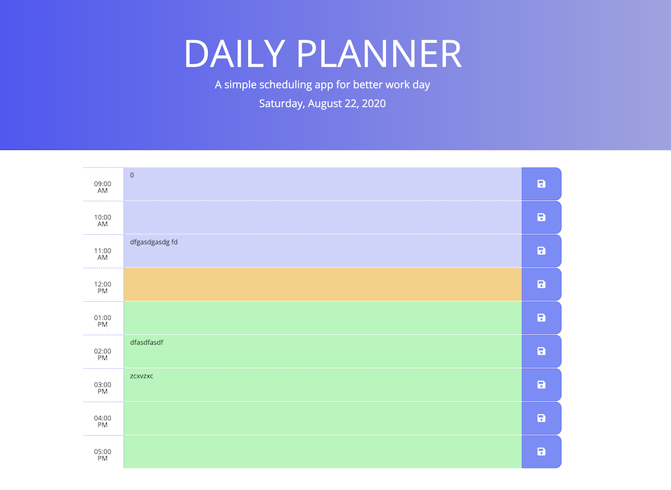

# daily-planner 
### Table of Content
- [daily-planner](#daily-planner)
    - [Table of Content](#table-of-content)
    - [1. Project Context - User Story](#1-project-context---user-story)
    - [2. Project Objectives](#2-project-objectives)
    - [3. Outcome](#3-outcome)
    - [4. Links](#4-links)
      - [Link to Website](#link-to-website)
      - [Link to Files](#link-to-files)
    - [5. Screenshots](#5-screenshots)
      - [Screenshots - Mobile View](#screenshots---mobile-view)
      - [Screenshots - Laptop view](#screenshots---laptop-view)
    - [6. Pseudocode - Logic Steps](#6-pseudocode---logic-steps)
    - [7. Installation](#7-installation)
    - [8. Credits:](#8-credits)
    - [9. What I've Learned](#9-what-ive-learned)
    - [10. License](#10-license)
        - [MIT License](#mit-license)
#

### 1. Project Context - User Story
* Use of a daily planner can help us, especially the ones with a busy schedule, better manage out time and accomplish greater results in lesser amounts of time.
* When users open the planner, the current day is displayed at the top of the calendar with timeblocks for standard business hours as users scroll down
* Each timeblock is color coded to indicate whether it is in the past, present, or future. 
* Users can enter an even and save the event via a button for that timeblock in local storage as long as they wish.

### 2. Project Objectives
* Create a simple calendar application that allows the user to save events for each hour of the day.
* This app will run in the browser and feature dynamically updated HTML and CSS powered by jQuery.
* It will also feature a clean and polished user interface and be responsive, ensuring that it adapts to multiple screen sizes.(I used the given HTML & CSS files with minimal custom styling)

### 3. Outcome
* The user interface is responsive to different devices - mobile, tablets, laptops and larger screen desktops
* The app dynamically takes in user input and store the day plan in the localStorage and display in the textarea

### 4. Links 

#### Link to Website
 https://imbingz.github.io/Daily-Planner/

#### Link to Files 
 https://github.com/imbingz/Daily-Planner

### 5. Screenshots 

<kbd></kbd>

#### Screenshots - Mobile View
<kbd></kbd>

####  Screenshots - Laptop view 
<kbd></kbd>

### 6. Pseudocode - Logic Steps
1. Users will see the current date and day when opening the work-day schedule 
1. See the time blocks before deciding where to enter to-dos 
1. Enter the to-dos in user-input area
1. User input will be automatically colorized as past, present, or future events
1. Save the user inputs 
1. Input can be erased or cleared 

### 7. Installation
* Access to GitHub.com and a code editor such as vscode is necessary
* Go to [github.com/imbingz/imbingz.github.io.]( https://github.com/imbingz/Daily-Planner)
* Click on the green button that says Clone or Download
* Choose how you would like to download: using the SSH/HTTPS keys or download the zip file
* Using SSH/HTTPS Key: You will copy the link shown and open up either terminal (mac: pre-installed) or gitbash (pc: must be installed). Once the application is open, you will type git clone paste url here. Once you have cloned the git repo, cd into the repo and type open. to open the folder which contains all files used for the website. Once inside the folder, click on index.html to open the website in the browser.
* Using Download ZIP: Click on Download Zip. Locate the file and double click it to unzip the file. Locate the unzipped folder and open it. All the files for the website will be within this folder. Click on index.html to open the website in the browser.
* If you like to test this Password Generator App, please click the link [here](https://imbingz.github.io/Daily-Planner/)

### 8. Credits:
 The following materials contribute to the completion of this project. 

[Mozilla HTML5 Guide](https://developer.mozilla.org/en-US/docs/Web/Guide/HTML/HTML5)
[w3 School CSS3](https://www.w3schools.com/css/css_intro.asp)
[Bootstrap4](https://getbootstrap.com/docs/4.0/getting-started/introduction/)
[Mozilla JavaScript](https://developer.mozilla.org/en-US/docs/Web/JavaScript)
[JQuey API](https://api.jquery.com/)
[moment.js](https://momentjs.com/)
[Google Fonts](https://fonts.google.com/)
[Font Awesome](https://fontawesome.com/)
[Visual Studio Code](https://code.visualstudio.com/)

[Youtube - Moment.js Tutorial]( https://www.youtube.com/watch?v=n80RRNS1k64&list=PLVvjrrRCBy2LWFkR7opQxWp4z0en6OHgw)
[moment.js introduction]( https://scrimba.com/casts/cwpDGhG)
[using moment.js](https://youtu.be/9JRvJ9aMLzc)
[JQuery.each()] (https://api.jquery.com/each/)
[Looping over array and objects in JavaScript](https://medium.com/chingu/looping-over-arrays-and-objects-in-javascript-57e1188c1ba2)
[Date Manipulation using JS](https://youtu.be/6c9ZKCs3z8g)
[Javascript Template Literal](https://youtu.be/NgF9-pdTDGs)

### 9. What I've Learned
1. There are multiple ways to solve the same issue and the most important thing is to make sure the functionalities work
2. It takes more practice to keep the codes DRY. 
3. Think like computer and don't skip small things 

### 10. License
##### MIT License

Copyright (c) [2020] [bingzhang]

Permission is hereby granted, free of charge, to any person obtaining a copy of this software and associated documentation files (the "Software"), to deal in the Software without restriction, including without limitation the rights to use, copy, modify, merge, publish, distribute, sublicense, and/or sell copies of the Software, and to permit persons to whom the Software is furnished to do so, subject to the following conditions:

The above copyright notice and this permission notice shall be included in all copies or substantial portions of the Software.

THE SOFTWARE IS PROVIDED "AS IS", WITHOUT WARRANTY OF ANY KIND, EXPRESS OR IMPLIED, INCLUDING BUT NOT LIMITED TO THE WARRANTIES OF MERCHANTABILITY, FITNESS FOR A PARTICULAR PURPOSE AND NON-INFRINGEMENT. IN NO EVENT SHALL THE AUTHORS OR COPYRIGHT HOLDERS BE LIABLE FOR ANY CLAIM, DAMAGES OR OTHER LIABILITY, WHETHER IN AN ACTION OF CONTRACT, TORT OR OTHERWISE, ARISING FROM, OUT OF OR IN CONNECTION WITH THE SOFTWARE OR THE USE OR OTHER DEALINGS IN THE SOFTWARE.

August 22, 2020.
